# 项目标题：

非线性辐射扩散问题的神经网络超分辨率算法研究

# 引言：

非线性辐射扩散方程的高分辨率数值求解对于精确模拟能量输运过程至关重要。然而，传统的数值方法（如有限元法、有限体积法）尽管能够通过极细网格获得参考解，其巨大的计算成本严重制约了实际工程应用。与此同时，直接采用粗网格求解会导致显著的数值耗散和相位误差，特别是在强非线性区域（如电离度函数 $z$ 急剧变化处）。这一困境本质上是一个典型的科学计算超分辨率问题：如何从低分辨率数值解中高效恢复高分辨率物理场。

针对这些问题，本项目提出了一种超分辨率神经网络框架，用神经网络直接学习从低分辨率网格到高分辨率网格的映射关系。该网络构建了"粗网格输入→网络预测→物理校正"的架构，在传统数据驱动损失的基础上，引入基于方程的物理约束，确保预测解严格满足物理规律，在保证非线性辐射扩散问题求解精度的同时提升求解效率。

# 方法：

## 问题描述：

给定 $\Omega = [0,1]\times[0,1]$ ，单温非线性辐射扩散问题的具体模型如下：

$$
\begin{aligned}
   & \frac{\partial E}{\partial t}-\nabla\cdot(D_L\nabla E) = 0 \\
   & 0.5E+D_L\nabla E\cdot n = \beta(x,y,t), \quad(x,y,t)\in\lbrace x=0\rbrace\times[0,1] \\
   & 0.5E+D_L\nabla E\cdot n = 0, \quad(x,y,t)\in\partial\Omega\setminus\lbrace x=0\rbrace\times[0,1] \\
   & E|_{t=0} = g(x,y,0)
\end{aligned}
$$

其中辐射扩散系数 $D_L$ 选用限流形式，即 $D_L = \frac{1}{3\sigma_{\alpha}+\frac{|\nabla E|}{E}}, \sigma_{\alpha} = \frac{z^3}{E^{3/4}}$ 。

双温非线性辐射扩散问题的具体模型如下：

$$
\begin{aligned}
   & \frac{\partial E}{\partial t} - \nabla \cdot (D_L \nabla E) = \sigma_{\alpha}(T^4 - E) \\
   & \frac{\partial T}{\partial t} - \nabla \cdot (K_L \nabla T) = \sigma_{\alpha}(E - T^4) \\
   & 0.5E + D_L \nabla E \cdot n = \beta(x,y,t), \quad (x,y,t) \in \lbrace x=0 \rbrace \times [0,1] \\
   & 0.5E + D_L \nabla E \cdot n = 0, \quad (x,y,t) \in \partial\Omega \setminus \lbrace x=0 \rbrace \times [0,1] \\
   & K_L \nabla T \cdot n = 0, \quad (x,y,t) \in \partial\Omega \times [0,1] \\
   & E\vert_{t=0} = T^4\vert_{t=0} = g(x,y,0)
\end{aligned}
$$

其中 $\Omega = [0,1]\times[0,1]$ 辐射扩散系数 $D_L, K_L$ 同样选用限流形式，即 $D_L = \frac{1}{3\sigma_{\alpha}+\frac{|\nabla E|}{E}}, \sigma_{\alpha} = \frac{z^3}{E^{3/4}}, K_L = \frac{T^4}{T^{3/2}z+T^{5/2}|\nabla T|}$ 。

对于上述单温、双温问题，电离度函数 $z$ 可以分为常数（zconst）、间断线性（zline）、双方形（zsquare）三种情况，初边值条件 $\beta(x,y,t), g(x,y,t)$ 则可以分为常数初值+线性边值（const）和高斯初值+零边值（gauss）两种情况。

## 参数设置：

### 全局参数：

#### 模型参数：

|参数      |说明      |默认值      |
|:--------:|:--------:|:--------:|
|model_name    |目标模型（"电离度函数类型-初边值函数类型"）    |"zconst-const"  |
|device_name   |计算设备（"cuda"或"cpu"）    |"cuda"          |
|ionization_type   |电离度函数类型（"zconst"或"zline"或"zsquare"）    |"zconst"          |

#### 网格参数：

|参数      |说明      |默认值      |
|:--------:|:--------:|:---------:|
|Nx   |x轴网格点数    |257    |
|Ny   |y轴网格点数    |257    |
|n    |下采样倍数     |4      |

#### 网络参数：

|参数      |说明      |默认值      |
|:--------:|:--------:|:---------:|
|depth   |隐藏层层数    |2    |
|width   |隐藏层单元数    |512    |

### 单温问题算法参数：

#### 第一阶段训练参数：

|参数      |说明      |默认值      |
|:--------:|:--------:|:---------:|
|Nfit_reg   |训练步数    |300    |
|lr_reg   |LBFGS优化器学习率    |1e-2    |
|epoch_reg    |训练轮次     |50      |

#### 第二阶段训练参数：

|参数      |说明      |默认值      |
|:--------:|:--------:|:---------:|
|Nfit_pde   |训练步数    |200    |
|lr_pde   |LBFGS优化器学习率    |1e-1    |
|epoch_pde    |训练轮次     |10      |

#### 可视化参数：

|参数      |说明      |默认值      |
|:--------:|:--------:|:---------:|
|vmax   |误差图像色带的最大值    |0.25    |

### 双温问题算法参数：

#### 第一阶段训练参数：

|参数      |说明      |默认值      |
|:--------:|:--------:|:---------:|
|Nfit_reg   |训练步数    |300    |
|lr_E_reg   |关于E的LBFGS优化器学习率    |1e-2    |
|lr_T_reg   |关于T的LBFGS优化器学习率    |1e-2    |
|epoch_reg    |训练轮次     |50      |

#### 第二阶段训练参数：

|参数      |说明      |默认值      |
|:--------:|:--------:|:---------:|
|Nfit_pde   |训练步数    |200    |
|lr_E_pde   |关于E的LBFGS优化器学习率    |1e-1    |
|lr_T_pde   |关于T的LBFGS优化器学习率    |1e-1    |
|epoch_pde    |训练轮次     |10      |

#### 可视化参数：

|参数      |说明      |默认值      |
|:--------:|:--------:|:---------:|
|vmax_E   |E的误差图像色带的最大值    |0.25    |
|vmax_T   |T的误差图像色带的最大值    |0.25    |

## 算法设计：

结合低分辨率数值解 $E_{coarse}$ 以及方程本身，我们设计了针对单一方程的新型神经网络解法。

构建一个全连接神经网络，将目标点的空间坐标值 $(x,y)$ 作为输入数据。该网络包含depth=2个隐藏层，每一层包含width=512个神经元，激活函数选用ReLU函数。输出层设置为二维通道，按电离度函数 $z$ 在不同目标点的大小设置布尔掩码，从而选择各目标点对应的输出通道。

为了保证求解效率，我们首先利用低分辨率参考解，构建数据驱动损失函数 $L_{reg}$ 进行训练。然后，结合目标辐射扩散问题的方程，设计包含物理约束的损失函数 $L_{reg+pde}$，进一步提升神经网络模型的求解精度。

以单温问题为例，我们用向后差分处理方程中的时间偏导，用神经网络分别计算每个时间层的结果，并在网络损失函数 $L_{reg+pde}$ 的设计部分考虑添加数据驱动损失 $L_{reg}$和物理信息损失 $L_{pde}$ 的约束，具体公式如下：

$$
\begin{aligned}
   & L_{reg+pde} = L_{reg}+10L_{pde} \\
   & L_{reg} = \Vert E^n-E^n_{coarse} \Vert \\
   & L_{pde} = \Vert E^n-D^n_{coarse}\nabla\cdot(\nabla E^n)\Delta t-E^{n-1}_{coarse} \Vert
\end{aligned}
$$

用同样的方法，我们也给出了双温问题的损失函数具体公式：

$$
\begin{aligned}
   L_{reg+pde} &= L_{reg} + 10L_{pde} \\
   L_{reg} &= \Vert E^n - E^n_{coarse} \Vert + \Vert T^n - T^n_{coarse} \Vert \\
   L_{pde} &= \Vert E^n - D^n_{coarse} \nabla \cdot (\nabla E^n) \Delta t - \sigma_{\alpha} (T^4 - E) \Delta t - E^{n-1}_{coarse} \Vert \\
   & + \Vert T^n - K^n_{coarse} \nabla \cdot (\nabla T^n) \Delta t - \sigma_{\alpha} (E - T^4) \Delta t - T^{n-1}_{coarse} \Vert
\end{aligned}
$$

# 数值实验：

## 实验设置：

取Nx×Ny=257×257的细网格点，设置时间步长为0.001，皮卡迭代的收敛极限为0.001，将有限元法求出的结果作为参考解。已知的粗网格解 $E_{coarse}$ 由参考解经过n=4倍下采样得到，分辨率为65×65。

我们的神经网络采用LBFGS优化器。

## 实验结果展示：

### 单温问题：

训练完成后会在 ./diffusion-1T/results/<model_name>/ 目录下生成：

(1) model_reg.pt : 第一阶段训练模型

(2) model_pinn.pt : 第二阶段训练模型

(3) sol_reg.npy : 第一阶段预测结果

(4) sol_pinn.npy : 第二阶段预测结果

(5) fig.png : 第一、第二阶段预测结果误差图像

#### zconst-const

电离度函数为常数（zconst）：$z=1$

初边值条件为常数初值+线性边值（const）：$$\beta (x,y,t) = \text{max} \lbrace 20t, 10\rbrace , g(x,y,t) = 0.01$$

设置第一次回归训练时的训练步数为Nfit_reg=100，学习率为lr_reg=1e-3；第二次PDE训练时的训练步数为Nfit_pde=200，学习率为lr_pde=1。可视化参数设置为vmax=0.1。

命令行参数如下：

```bash
python ./diffusion-1T/main.py --model_name "zconst-const" --ionization_type "zconst" --Nfit_reg 100 --lr_reg 1e-3 --Nfit_pde 200 --lr_pde 1 --vmax 0.1
```

两次训练结果与参考解之间的l2相对误差以及误差图像如下：

|训练      |l2相对误差 |
|:--------:|:--------:|
|第一次训练   |1.3803e-4|
|第二次训练   |7.9253e-7|


#### zconst-gauss

电离度函数为常数（zconst）：$z=1$

初边值条件为高斯初值+零边值（gauss）：$\beta(x,y,t) = 0, g(x,y,t) = 0.01+100e^{-(x^2+y^2)/0.01}$

设置第一次回归训练时的训练步数为Nfit_reg=200，学习率为lr_reg=1e-3；第二次PDE训练时的训练步数为Nfit_pde=200，学习率为lr_pde=1。可视化参数设置为vmax=0.02。

命令行参数如下：

```bash
python ./diffusion-1T/main.py --model_name "zconst-gauss" --ionization_type "zconst" --Nfit_reg 200 --lr_reg 1e-3 --Nfit_pde 200 --lr_pde 1 --vmax 0.02
```

两次训练结果与参考解之间的l2相对误差以及误差图像如下：

|训练      |l2相对误差 |
|:--------:|:--------:|
|第一次训练   |3.1160e-3|
|第二次训练   |1.0960e-5|

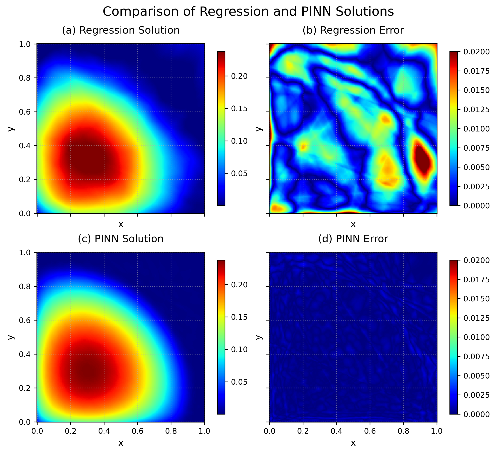

#### zline-const

电离度函数为间断线性（zline）：当 $x\leq0.5$ 时， $z=1$ ；当 $x>0.5$ 时， $z=10$

初边值条件为常数初值+线性边值（const）：$\beta(x,y,t) = \max\{20t, 10\}, g(x,y,t) = 0.01$

设置第一次回归训练时的训练步数为Nfit_reg=150，学习率为lr_reg=1e-2；第二次PDE训练时的训练步数为Nfit_pde=200，学习率为lr_pde=1。可视化参数设置为vmax=0.25。

命令行参数如下：

```bash
python ./diffusion-1T/main.py --model_name "zline-const" --ionization_type "zline" --Nfit_reg 150 --lr_reg 1e-2 --Nfit_pde 200 --lr_pde 1 --vmax 0.25
```

两次训练结果与参考解之间的l2相对误差以及误差图像如下：

|训练      |l2相对误差 |
|:--------:|:--------:|
|第一次训练   |8.6974e-5|
|第二次训练   |2.6432e-5|

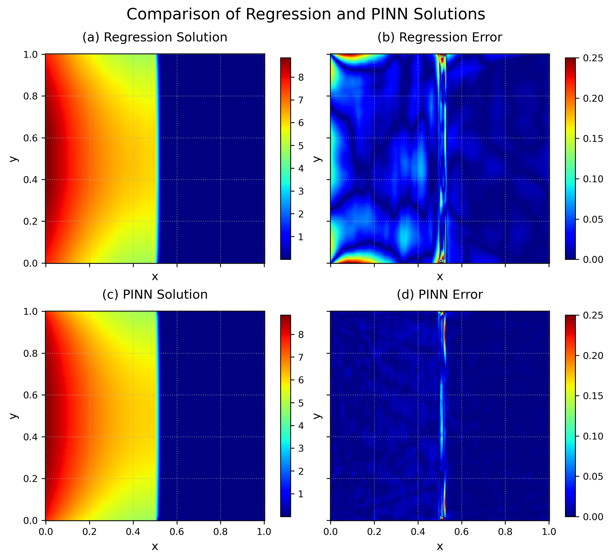

#### zline-gauss

电离度函数为间断线性（zline）：当 $x\leq0.5$ 时， $z=1$ ；当 $x>0.5$ 时， $z=10$

初边值条件为高斯初值+零边值（gauss）：$\beta(x,y,t) = 0, g(x,y,t) = 0.01+100e^{-(x^2+y^2)/0.01}$

设置第一次回归训练时的训练步数为Nfit_reg=200，学习率为lr_reg=1e-2；第二次PDE训练时的训练步数为Nfit_pde=100，学习率为lr_pde=1。可视化参数设置为vmax=0.072。

命令行参数如下：

```bash
python ./diffusion-1T/main.py --model_name "zline-gauss" --ionization_type "zline" --Nfit_reg 200 --lr_reg 1e-2 --Nfit_pde 100 --lr_pde 1 --vmax 0.072
```

两次训练结果与参考解之间的l2相对误差以及误差图像如下：

|训练      |l2相对误差 |
|:--------:|:--------:|
|第一次训练   |1.2046e-3|
|第二次训练   |8.1885e-4|

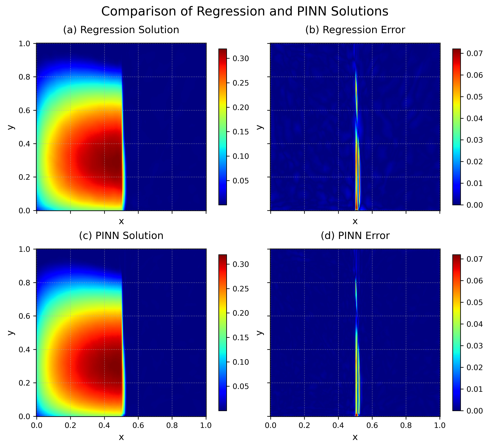

#### zsquare-const

电离度函数为双方形（zsquare）：当 $\frac{3}{16}<x<\frac{7}{16}, \frac{9}{16}<y<\frac{13}{16}$ 或 $\frac{9}{16}<x<\frac{13}{16}, \frac{3}{16}<y<\frac{7}{16}$ 时， $z=10$ ；其他时候 $z=1$

初边值条件为常数初值+线性边值（const）：$\beta(x,y,t) = \max\{20t, 10\}, g(x,y,t) = 0.01$

设置第一次回归训练时的训练步数为Nfit_reg=150，学习率为lr_reg=1e-2；第二次PDE训练时的训练步数为Nfit_pde=300，学习率为lr_pde=1e-1。可视化参数设置为vmax=1.0。

命令行参数如下：

```bash
python ./diffusion-1T/main.py --model_name "zsquare-const" --ionization_type "zsquare" --Nfit_reg 150 --lr_reg 1e-2 --Nfit_pde 300 --lr_pde 1e-1 --vmax 1.0
```

两次训练结果与参考解之间的l2相对误差以及误差图像如下：

|训练      |l2相对误差 |
|:--------:|:--------:|
|第一次训练   |7.7425e-4|
|第二次训练   |3.1866e-4|

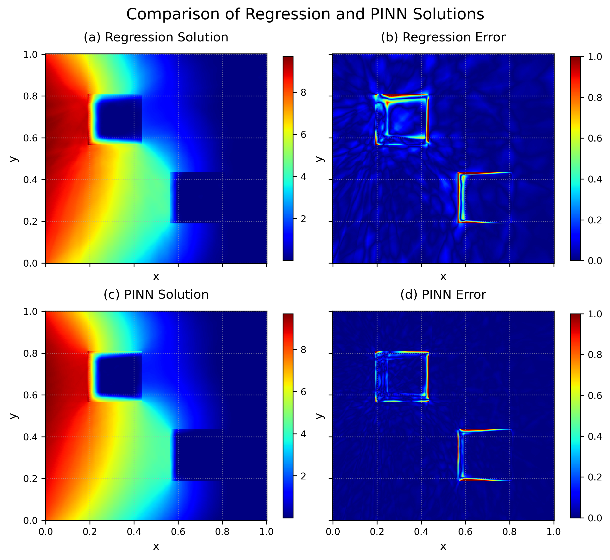

#### zsquare-gauss

电离度函数为双方形（zsquare）：当 $\frac{3}{16}<x<\frac{7}{16}, \frac{9}{16}<y<\frac{13}{16}$ 或 $\frac{9}{16}<x<\frac{13}{16}, \frac{3}{16}<y<\frac{7}{16}$ 时， $z=10$ ；其他时候 $z=1$

初边值条件为高斯初值+零边值（gauss）：$\beta(x,y,t) = 0, g(x,y,t) = 0.01+100e^{-(x^2+y^2)/0.01}$

设置第一次回归训练时的训练步数为Nfit_reg=400，学习率为lr_reg=1e-1；第二次PDE训练时的训练步数为Nfit_pde=350，学习率为lr_pde=1。可视化参数设置为vmax=0.16。

命令行参数如下：

```bash
python ./diffusion-1T/main.py --model_name "zsquare-gauss" --ionization_type "zsquare" --Nfit_reg 400 --lr_reg 1e-1 --Nfit_pde 350 --lr_pde 1 --vmax 0.16
```

两次训练结果与参考解之间的l2相对误差以及误差图像如下：

|训练      |l2相对误差 |
|:--------:|:--------:|
|第一次训练   |4.7518e-3|
|第二次训练   |3.9955e-3|

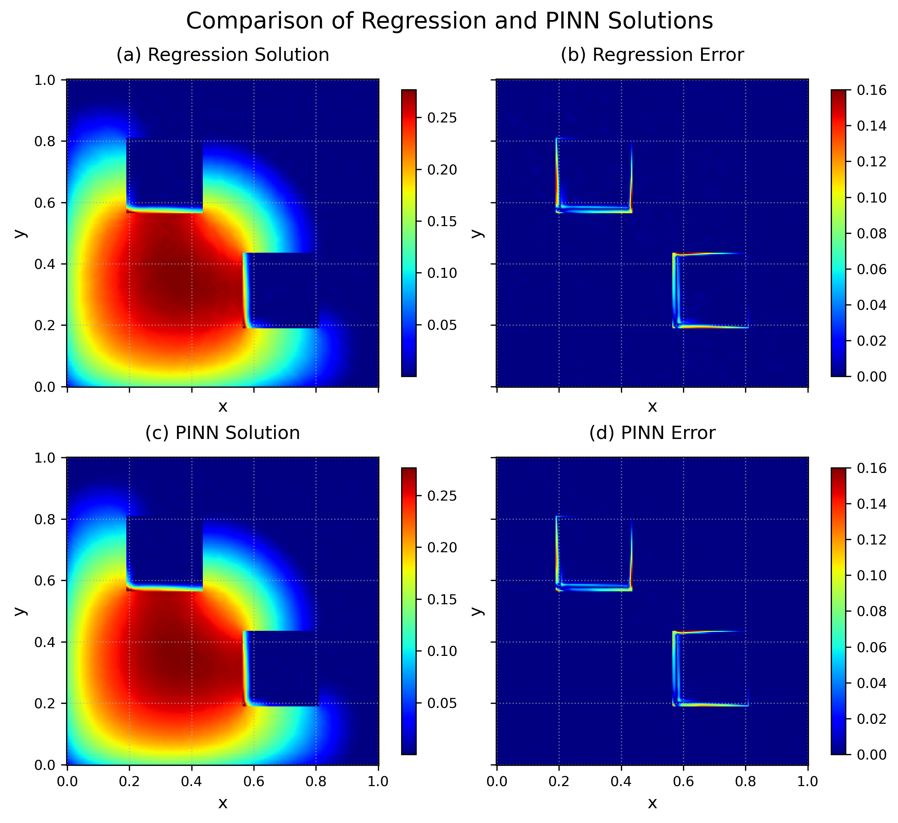

### 双温问题：

训练完成后会在 ./diffusion-2T/results/<model_name>/ 目录下生成：

(1) model_reg_E.pt : 第一阶段关于E的训练模型

(2) model_reg_T.pt : 第一阶段关于T的训练模型

(3) model_pinn_E.pt : 第二阶段关于E的训练模型

(4) model_pinn_T.pt : 第二阶段关于T的训练模型

(5) sol_reg_E.npy : 第一阶段对E的预测结果

(6) sol_reg_T.npy : 第一阶段对T的预测结果

(7) sol_pinn_E.npy : 第二阶段对E的预测结果

(8) sol_pinn_T.npy : 第二阶段对T的预测结果

(9) fig_E.png : 关于E的第一、第二阶段预测结果误差图像

(10) fig_T.png : 关于T的第一、第二阶段预测结果误差图像

#### zconst-const

电离度函数为常数（zconst）：$z=1$

初边值条件为常数初值+线性边值（const）：$\beta(x,y,t) = \max\{20t, 10\}, g(x,y,t) = 0.01$

设置第一次回归训练时的训练步数为Nfit_reg=300，关于E的学习率为lr_E_reg=1e-3，关于T的学习率为lr_T_reg=1e-3；第二次PDE训练时的训练步数为Nfit_pde=200，关于E的学习率为lr_E_pde=1e-2，关于T的学习率为lr_T_pde=1e-2。可视化参数设置为vmax_E=0.28，vmax_T=0.02。

命令行参数如下：

```bash
python ./diffusion-2T/main.py --model_name "zconst-const" --ionization_type "zconst" --Nfit_reg 300 --lr_E_reg 1e-3 --lr_T_reg 1e-3 --Nfit_pde 200 --lr_E_pde 1e-2 --lr_T_pde 1e-2 --vmax_E 0.28 --vmax_T 0.02
```

关于变量E和T的两次训练结果与参考解之间的l2相对误差以及误差图像如下：

|训练      |E的l2相对误差 |T的l2相对误差 |
|:--------:|:-----------:|:-----------:|
|第一次训练 |1.0433e-4    |3.8226e-5    |
|第二次训练 |4.1970e-5    |4.8864e-6    |

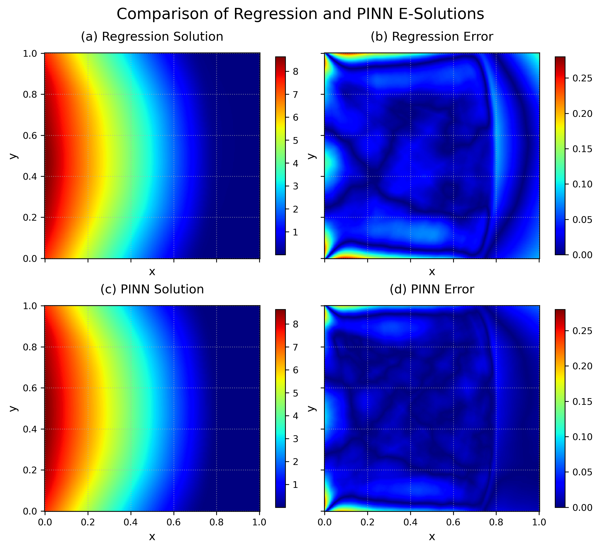 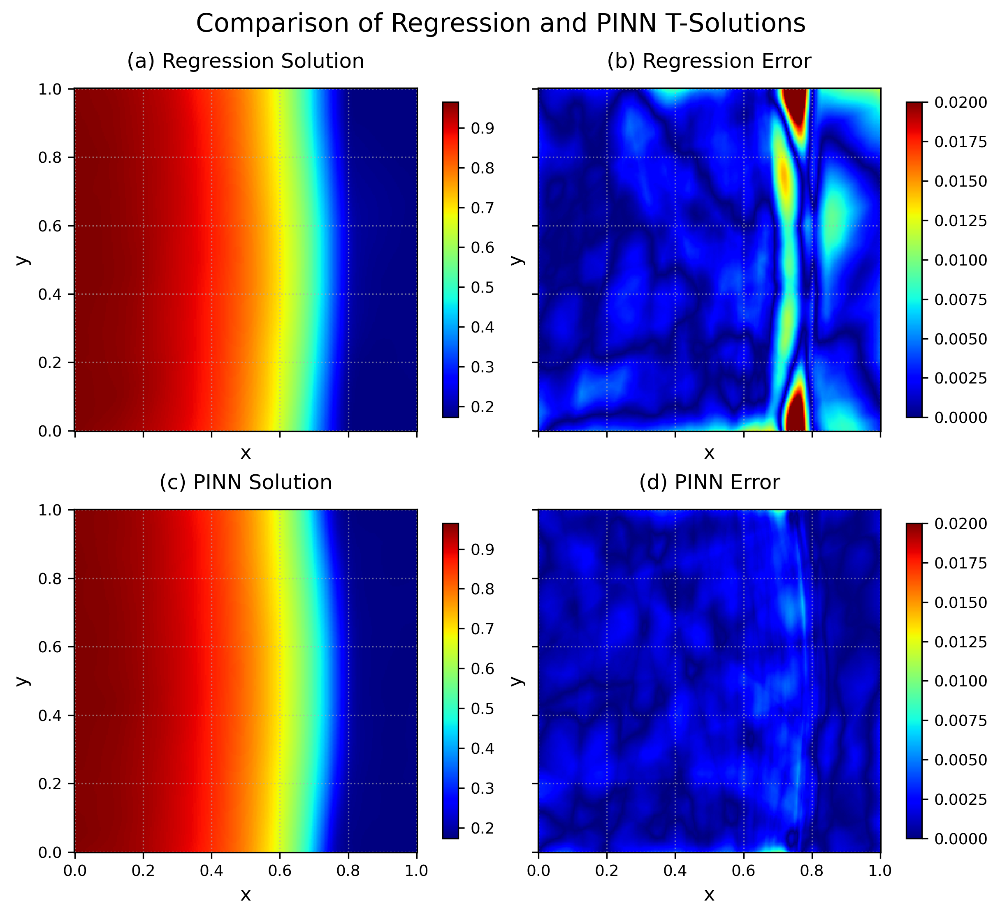

#### zconst-gauss

电离度函数为常数（zconst）：$z=1$

初边值条件为高斯初值+零边值（gauss）：$\beta(x,y,t) = 0, g(x,y,t) = 0.01+100e^{-(x^2+y^2)/0.01}$

设置第一次回归训练时的训练步数为Nfit_reg=300，关于E的学习率为lr_E_reg=1e-3，关于T的学习率为lr_T_reg=1e-3；第二次PDE训练时的训练步数为Nfit_pde=200，关于E的学习率为lr_E_pde=1e-1，关于T的学习率为lr_T_pde=1e-1。可视化参数设置为vmax_E=0.004，vmax_T=0.015。

命令行参数如下：

```bash
python ./diffusion-1T/main.py --model_name "zconst-gauss" --ionization_type "zconst" --Nfit_reg 300 --lr_E_reg 1e-3 --lr_T_reg 1e-3 --Nfit_pde 200 --lr_E_pde 1e-1 --lr_T_pde 1e-1 --vmax_E 0.004 --vmax_T 0.015
```

两次训练结果与参考解之间的l2相对误差以及误差图像如下：

|训练      |E的l2相对误差 |T的l2相对误差 |
|:--------:|:-----------:|:-----------:|
|第一次训练 |1.2102e-4    |5.3335e-5    |
|第二次训练 |7.9144e-6    |2.6790e-6    |

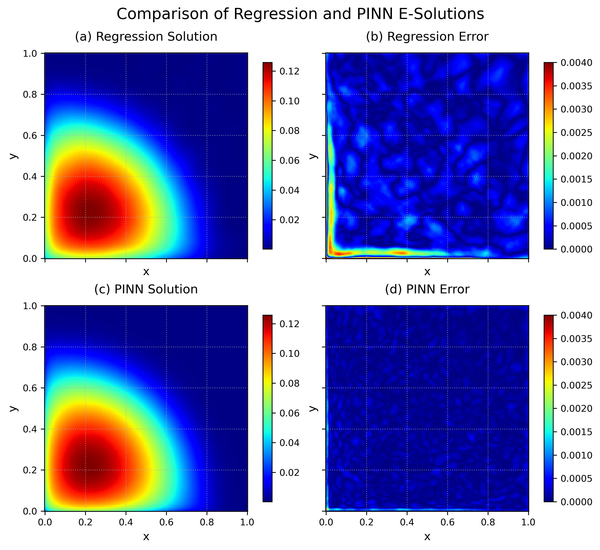 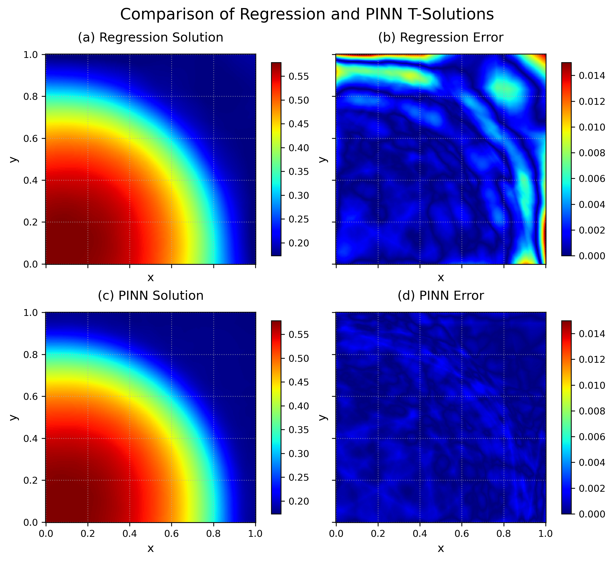

#### zline-const

电离度函数为间断线性（zline）：当 $x\leq0.5$ 时， $z=1$ ；当 $x>0.5$ 时， $z=10$

初边值条件为常数初值+线性边值（const）：$\beta(x,y,t) = \max\{20t, 10\}, g(x,y,t) = 0.01$

设置第一次回归训练时的训练步数为Nfit_reg=300，关于E的学习率为lr_E_reg=1e-2，关于T的学习率为lr_T_reg=1e-2；第二次PDE训练时的训练步数为Nfit_pde=200，关于E的学习率为lr_E_pde=1e-1，关于T的学习率为lr_T_pde=1e-1。可视化参数设置为vmax_E=1.7，vmax_T=0.03。

命令行参数如下：

```bash
python ./diffusion-2T/main.py --model_name "zline-const" --ionization_type "zline" --Nfit_reg 300 --lr_E_reg 1e-2 --lr_T_reg 1e-2 --Nfit_pde 200 --lr_E_pde 1e-1 --lr_T_pde 1e-1 --vmax_E 1.7 --vmax_T 0.03
```

关于变量E和T的两次训练结果与参考解之间的l2相对误差以及误差图像如下：

|训练      |E的l2相对误差 |T的l2相对误差 |
|:--------:|:-----------:|:-----------:|
|第一次训练 |3.3480e-4    |9.3573e-6    |
|第二次训练 |9.2222e-4    |4.3018e-6    |

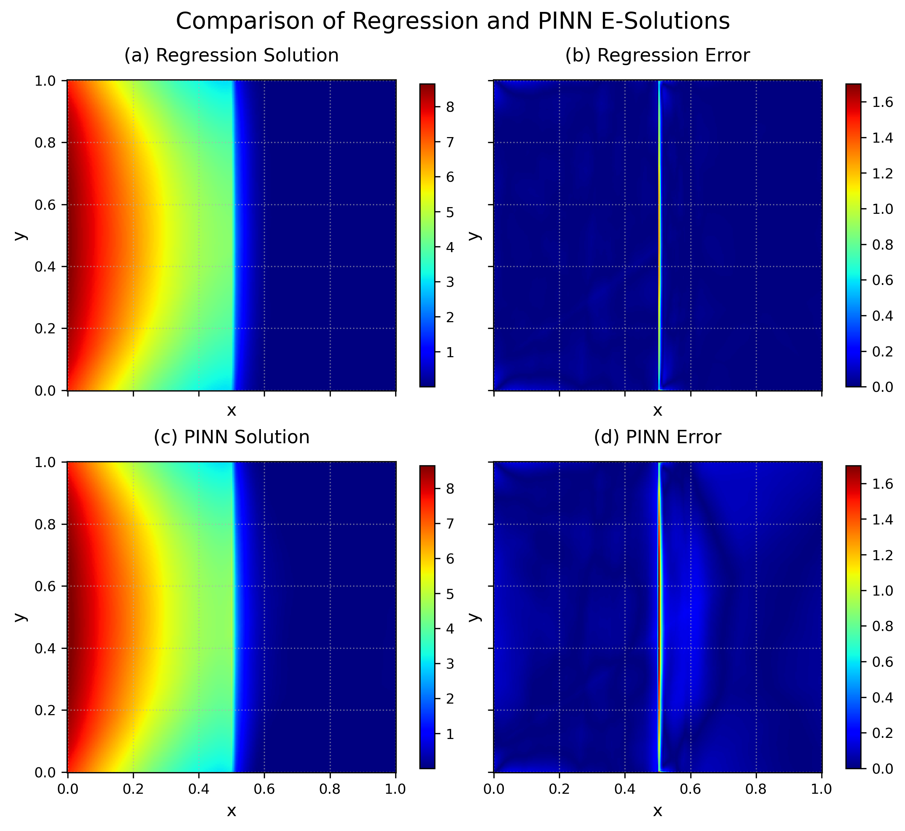 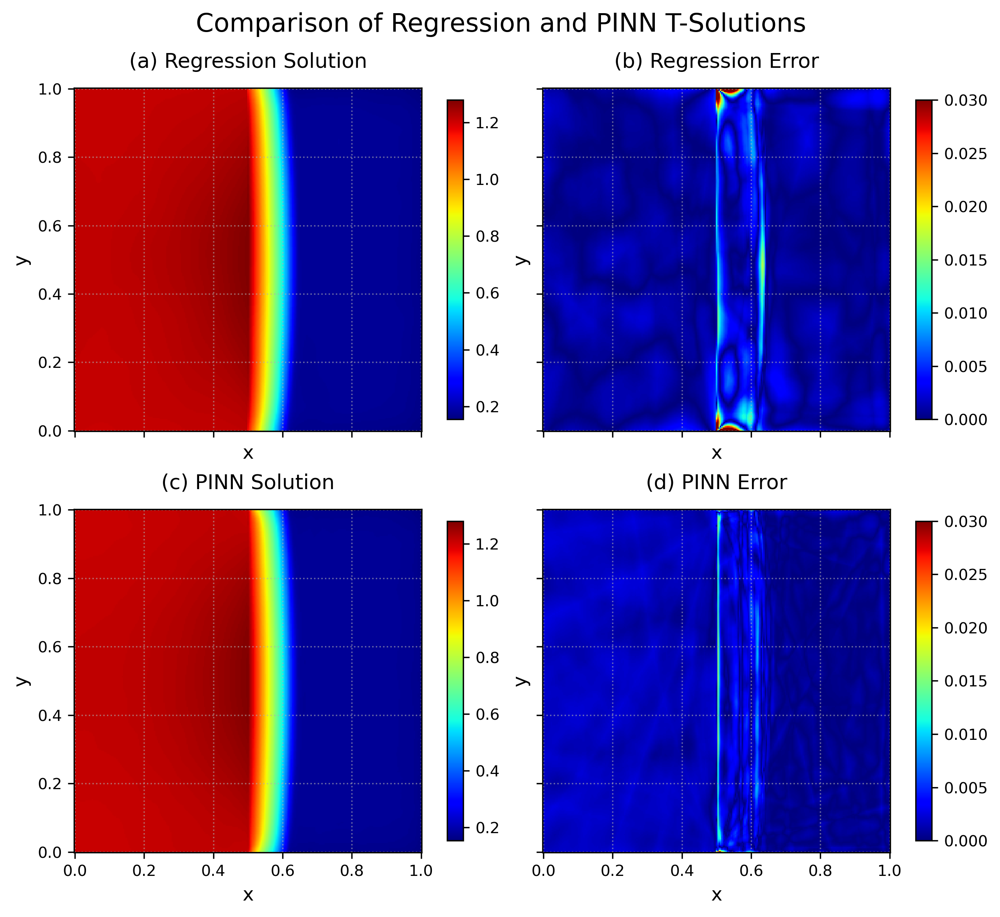

#### zline-gauss

电离度函数为间断线性（zline）：当 $x\leq0.5$ 时， $z=1$ ；当 $x>0.5$ 时， $z=10$

初边值条件为高斯初值+零边值（gauss）：$\beta(x,y,t) = 0, g(x,y,t) = 0.01+100e^{-(x^2+y^2)/0.01}$

设置第一次回归训练时的训练步数为Nfit_reg=200，关于E的学习率为lr_E_reg=1e-3，关于T的学习率为lr_T_reg=1e-4；第二次PDE训练时的训练步数为Nfit_pde=200，关于E的学习率为lr_E_pde=1e-1，关于T的学习率为lr_T_pde=1e-1。可视化参数设置为vmax_E=0.012，vmax_T=0.15。

命令行参数如下：

```bash
python ./diffusion-1T/main.py --model_name "zline-gauss" --ionization_type "zline" --Nfit_reg 200 --lr_E_reg 1e-3 --lr_T_reg 1e-4 --Nfit_pde 200 --lr_E_pde 1e-1 --lr_T_pde 1e-1 --vmax_E 0.012 --vmax_T 0.15
```

两次训练结果与参考解之间的l2相对误差以及误差图像如下：

|训练      |E的l2相对误差 |T的l2相对误差 |
|:--------:|:-----------:|:-----------:|
|第一次训练 |3.2893e-4    |2.0064e-2    |
|第二次训练 |9.5702e-6    |4.9225e-4    |

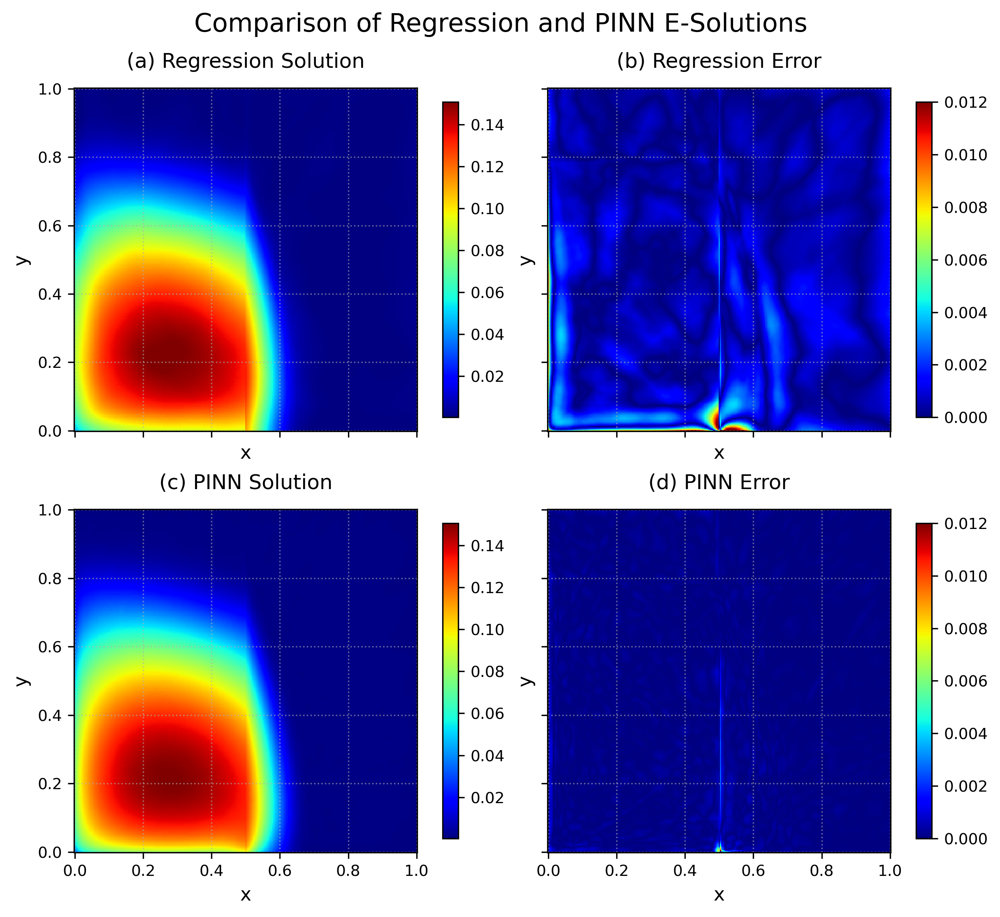 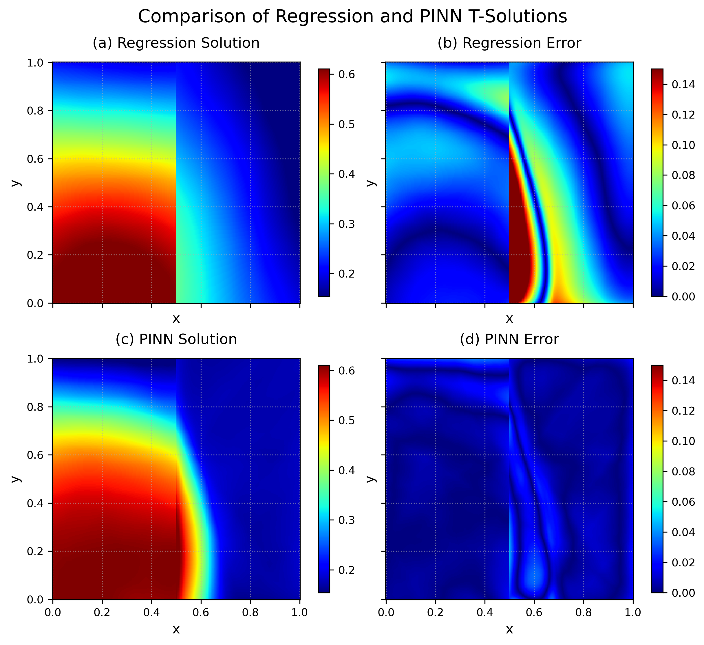

#### zsquare-const

电离度函数为双方形（zsquare）：当 $\frac{3}{16}<x<\frac{7}{16}, \frac{9}{16}<y<\frac{13}{16}$ 或 $\frac{9}{16}<x<\frac{13}{16}, \frac{3}{16}<y<\frac{7}{16}$ 时， $z=10$ ；其他时候 $z=1$

初边值条件为常数初值+线性边值（const）：$\beta(x,y,t) = \max\{20t, 10\}, g(x,y,t) = 0.01$

设置第一次回归训练时的训练步数为Nfit_reg=300，关于E的学习率为lr_E_reg=1e-3，关于T的学习率为lr_T_reg=1e-3；第二次PDE训练时的训练步数为Nfit_pde=200，关于E的学习率为lr_E_pde=1e-1，关于T的学习率为lr_T_pde=1e-1。可视化参数设置为vmax_E=0.6，vmax_T=0.15。

命令行参数如下：

```bash
python ./diffusion-2T/main.py --model_name "zsquare-const" --ionization_type "zsquare" --Nfit_reg 300 --lr_E_reg 1e-3 --lr_T_reg 1e-3 --Nfit_pde 200 --lr_E_pde 1e-1 --lr_T_pde 1e-1 --vmax_E 0.6 --vmax_T 0.15
```

关于变量E和T的两次训练结果与参考解之间的l2相对误差以及误差图像如下：

|训练      |E的l2相对误差 |T的l2相对误差 |
|:--------:|:-----------:|:-----------:|
|第一次训练 |1.6882e-3    |9.2393e-4    |
|第二次训练 |3.9618e-5    |5.0227e-6    |

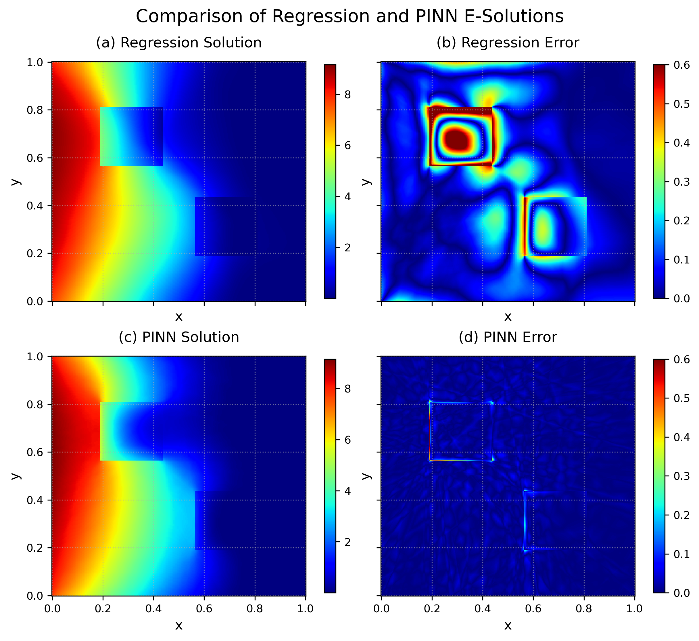 

#### zsquare-gauss

电离度函数为双方形（zsquare）：当 $\frac{3}{16}<x<\frac{7}{16}, \frac{9}{16}<y<\frac{13}{16}$ 或 $\frac{9}{16}<x<\frac{13}{16}, \frac{3}{16}<y<\frac{7}{16}$ 时， $z=10$ ；其他时候 $z=1$

初边值条件为高斯初值+零边值（gauss）：$\beta(x,y,t) = 0, g(x,y,t) = 0.01+100e^{-(x^2+y^2)/0.01}$

设置第一次回归训练时的训练步数为Nfit_reg=700，关于E的学习率为lr_E_reg=1e-3，关于T的学习率为lr_T_reg=1e-3；第二次PDE训练时的训练步数为Nfit_pde=100，关于E的学习率为lr_E_pde=1e-1，关于T的学习率为lr_T_pde=1e-1。可视化参数设置为vmax_E=0.006，vmax_T=0.11。

命令行参数如下：

```bash
python ./diffusion-1T/main.py --model_name "zsquare-gauss" --ionization_type "zsquare" --Nfit_reg 700 --lr_E_reg 1e-3 --lr_T_reg 1e-3 --Nfit_pde 100 --lr_E_pde 1e-1 --lr_T_pde 1e-1 --vmax_E 0.006 --vmax_T 0.11
```

两次训练结果与参考解之间的l2相对误差以及误差图像如下：

|训练      |E的l2相对误差 |T的l2相对误差 |
|:--------:|:-----------:|:-----------:|
|第一次训练 |3.5218e-4    |1.4630e-3    |
|第二次训练 |2.2470e-5    |6.6278e-4    |

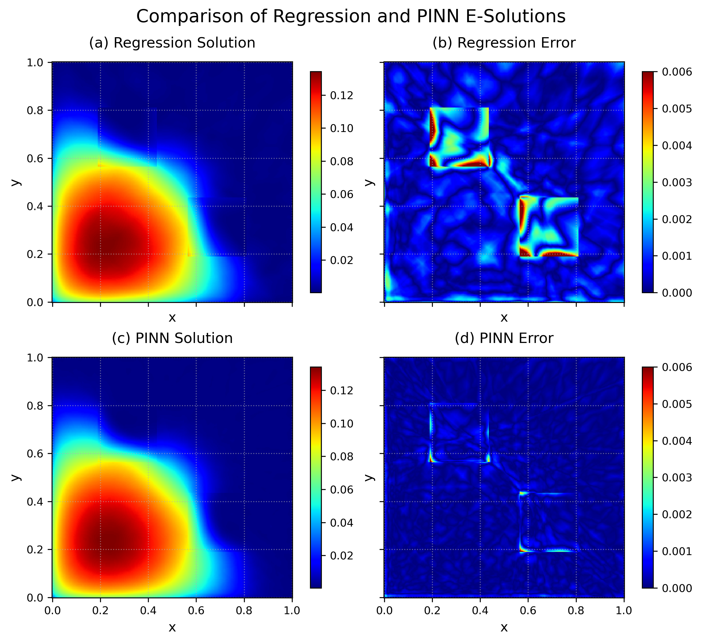 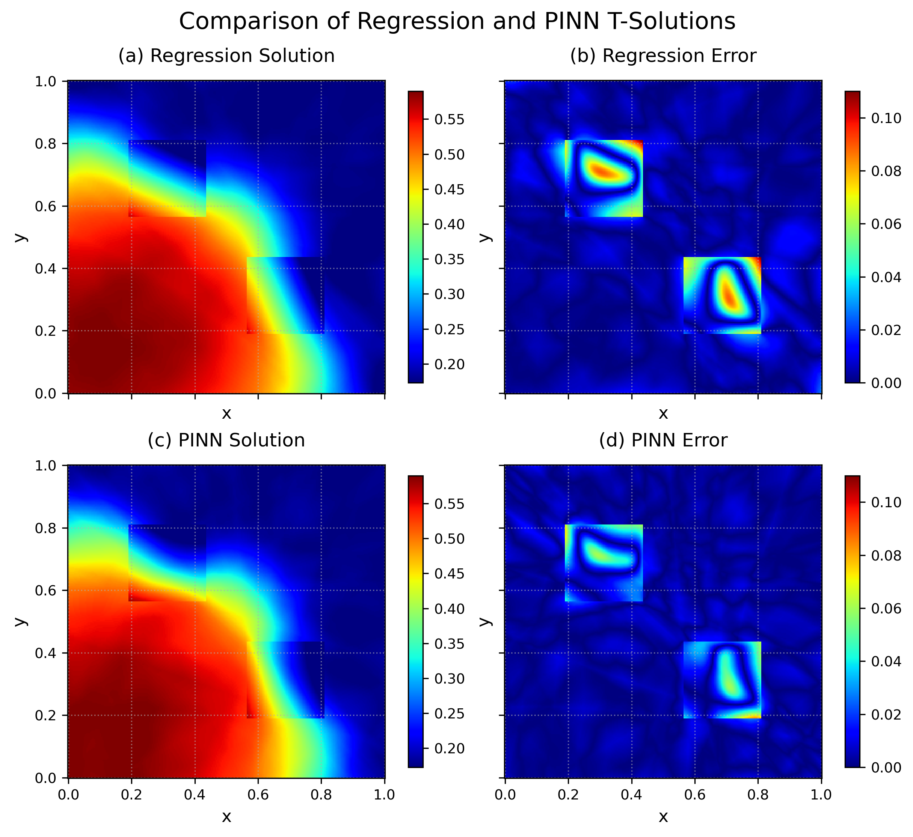

-----------------------------------------------------------------------------------------------------------------------------

# Project Title:

Research on Neural Network Super-Resolution Algorithms for Nonlinear Radiation Diffusion Problems

# Introduction:

High-resolution numerical solutions of nonlinear radiation diffusion equations are crucial for accurately simulating energy transport processes. However, though traditional numerical methods (e.g., finite element method, finite volume method) are capable of obtaining reference solutions through extremely fine grids, they suffer from prohibitive computational costs that severely limit practical engineering applications. Meanwhile, direct coarse-grid solutions introduce significant numerical dissipation and phase errors, particularly in strongly nonlinear regions (e.g., where the ionization degree function $z$ undergoes sharp variations). This dilemma represents a quintessential scientific computing super-resolution problem: how to efficiently reconstruct high-resolution physical fields from low-resolution numerical solutions.

To address these challenges, this project proposes a super-resolution neural network framework that directly learns the mapping from low-resolution to high-resolution grids. The network establishes an architecture of "coarse-grid input → network prediction → physical correction," incorporating equation-based physical constraints alongside traditional data-driven loss functions. This ensures predicted solutions strictly adhere to physical laws while maintaining the accuracy of nonlinear radiation diffusion problem solutions and significantly improving computational efficiency.

# Method:

## Problem Setup:

With $\Omega = [0,1]\times[0,1]$ , the specific model for the single-temperature nonlinear radiation diffusion problem is as follows:

$$
\begin{aligned}
   & \frac{\partial E}{\partial t}-\nabla\cdot(D_L\nabla E) = 0 \\
   & 0.5E+D_L\nabla E\cdot n = \beta(x,y,t), \quad(x,y,t)\in\lbrace x=0\rbrace\times[0,1] \\
   & 0.5E+D_L\nabla E\cdot n = 0, \quad(x,y,t)\in\partial\Omega\setminus\lbrace x=0\rbrace\times[0,1] \\
   & E|_{t=0} = g(x,y,0)
\end{aligned}
$$

where the radiation diffusion coefficient $D_L$ adopts the flux-limited form, expressed as $D_L = \frac{1}{3\sigma_{\alpha}+\frac{|\nabla E|}{E}}, \sigma_{\alpha} = \frac{z^3}{E^{3/4}}$ .

The specific model for the two-temperature nonlinear radiation diffusion problem is as follows:

$$
\begin{aligned}
   & \frac{\partial E}{\partial t} - \nabla \cdot (D_L \nabla E) = \sigma_{\alpha}(T^4 - E) \\
   & \frac{\partial T}{\partial t} - \nabla \cdot (K_L \nabla T) = \sigma_{\alpha}(E - T^4) \\
   & 0.5E + D_L \nabla E \cdot n = \beta(x,y,t), \quad (x,y,t) \in \lbrace x=0 \rbrace \times [0,1] \\
   & 0.5E + D_L \nabla E \cdot n = 0, \quad (x,y,t) \in \partial\Omega \setminus \lbrace x=0 \rbrace \times [0,1] \\
   & K_L \nabla T \cdot n = 0, \quad (x,y,t) \in \partial\Omega \times [0,1] \\
   & E\vert_{t=0} = T^4\vert_{t=0} = g(x,y,0)
\end{aligned}
$$

where the radiation diffusion coefficient $D_L, K_L$ also adopts the flux-limited form, expressed as $D_L = \frac{1}{3\sigma_{\alpha}+\frac{|\nabla E|}{E}}, \sigma_{\alpha} = \frac{z^3}{E^{3/4}}, K_L = \frac{T^4}{T^{3/2}z+T^{5/2}|\nabla T|}$ .

For the single-temperature and two-temperature problems mentioned above, the ionization function $z$ can be classified into three cases: "zconst" (constant), "zline" (intermittent linear) and "zsquare" (two-squares). Initial and boundary conditions $\beta(x,y,t), g(x,y,t)$ can also be classified into two cases: "const" (constant initial+linear boundary) and "gauss" (gauss initial+zero boundary).

## Parameter specification:

### Global Parameters:

#### Model parameters:

|Parameter      |Description      |Default      |
|:--------:|:--------:|:--------:|
|model_name    |target model ("ionization function type-initial&boundary condition type")   |"zconst-const"  |
|device_name   |computation device ("cuda" or "cpu")    |"cuda"          |
|ionization_type   |ionization function type ("zconst", "zline" or "zsquare")    |"zconst"          |

#### Grid parameters:

|Parameter      |Description      |Default      |
|:--------:|:--------:|:---------:|
|Nx   |grid points on x-axis    |257    |
|Ny   |grid points on x-axis    |257    |
|n    |downsampling factor      |4      |

#### Model parameters:

|Parameter      |Description      |Default      |
|:--------:|:--------:|:---------:|
|depth   |Number of hidden layers    |2    |
|width   |Number of units in each hidden layer    |512    |

### Parameters of single-temperature problem:

#### Training parameters (Phase 1):

|Parameter      |Description      |Default      |
|:--------:|:--------:|:---------:|
|Nfit_reg   |training iterations    |300    |
|lr_reg   |LBFGS optimizer learning rate    |1e-2    |
|epoch_reg    |training epochs     |50      |

#### Training parameters (Phase 2):

|Parameter      |Description      |Default      |
|:--------:|:--------:|:---------:|
|Nfit_pde   |training iterations    |200    |
|lr_pde   |LBFGS optimizer learning rate    |1e-1    |
|epoch_pde    |training epochs     |10      |

#### Visualization parameters:

|Parameter      |Description      |Default      |
|:--------:|:--------:|:---------:|
|vmax   |Maximum value of error colorbar    |0.25    |

### Parameters of two-temperature problem:

#### Training parameters (Phase 1):

|Parameter      |Description      |Default      |
|:--------:|:--------:|:---------:|
|Nfit_reg   |training iterations    |300    |
|lr_E_reg   |LBFGS optimizer learning rate of E   |1e-2    |
|lr_T_reg   |LBFGS optimizer learning rate of T    |1e-2    |
|epoch_reg    |training epochs     |50      |

#### Training parameters (Phase 2):

|Parameter      |Description      |Default      |
|:--------:|:--------:|:---------:|
|Nfit_pde   |training iterations    |200    |
|lr_E_pde   |LBFGS optimizer learning rate of E    |1e-1    |
|lr_T_pde   |LBFGS optimizer learning rate of T    |1e-1    |
|epoch_pde    |training epochs     |10      |

#### Visualization parameters:

|Parameter      |Description      |Default      |
|:--------:|:--------:|:---------:|
|vmax_E   |Maximum value of error colorbar E   |0.25    |
|vmax_T   |Maximum value of error colorbar T   |0.25    |

## Algorithm Design:

We propose a novel neural network-based solver for a single equation by combining low-resolution numerical solutions $E_{coarse}$ with the governing equation itself.

We construct a fully connected neural network that takes the spatial coordinates of target points $(x,y)$ as input data. The network consists of "depth"=2 hidden layers, each containing "width"=512 neurons, with ReLU activation functions. The output layer is configured as a two-channel structure, where a Boolean mask is applied based on the magnitude of the ionization function $z$ at different target points to select the corresponding output channel for each target point.

To ensure solving efficiency, we first utilize the low-resolution reference solution to construct a data-driven loss function $L_{reg}$ for training. Then, incorporating the equations of the target radiation diffusion problem, we design a physics-constrained loss function $L_{reg+pde}$ to further improve the solving accuracy of the neural network model.

Taking the single-temperature problem as an example, we discretize the temporal derivative in the equation using backward differencing and employ a neural network to compute the results at each time step. The loss function $L_{reg+pde}$ of the network incorporates both data-driven loss $L_{reg}$ and physics-informed loss $L_{pde}$ as constraints. The specific formulation is as follows:

$$
\begin{aligned}
   & L_{reg+pde} = L_{reg}+10L_{pde} \\
   & L_{reg} = \Vert E^n-E^n_{coarse} \Vert \\
   & L_{pde} = \Vert E^n-D^n_{coarse}\nabla\cdot(\nabla E^n)\Delta t-E^{n-1}_{coarse} \Vert
\end{aligned}
$$

Using the same methodology, we also derive the specific formulation of the loss function for the two-temperature problem as follows:

$$
\begin{aligned}
   L_{reg+pde} &= L_{reg} + 10L_{pde} \\
   L_{reg} &= \Vert E^n - E^n_{coarse} \Vert + \Vert T^n - T^n_{coarse} \Vert \\
   L_{pde} &= \Vert E^n - D^n_{coarse} \nabla \cdot (\nabla E^n) \Delta t - \sigma_{\alpha} (T^4 - E) \Delta t - E^{n-1}_{coarse} \Vert \\
   &\quad + \Vert T^n - K^n_{coarse} \nabla \cdot (\nabla T^n) \Delta t - \sigma_{\alpha} (E - T^4) \Delta t - T^{n-1}_{coarse} \Vert
\end{aligned}
$$

# Numerical Experiments:

## Experimental Settings:

The finite element method solutions are taken as reference solutions, using a fine-grid of "Nx"×"Ny"=257×257 spatial points with the time step size 0.001 and the tolerance of Picard iteration convergence criterion 0.001. The known coarse-grid solution $E_{coarse}$ is obtained by "n"=4 times downsampling of the reference solutions, resulting in a resolution of 65×65.

Our neural network employs the LBFGS optimizer.

## Experimental Results:

### Single-Temperature Problem:

Results will be saved in "./diffusion-1T/results/<model_name>/":

(1) model_reg.pt : Phase 1 regression trained model

(2) model_pinn.pt : Phase 2 physics-informed model

(3) sol_reg.npy : Phase 1 predictions

(4) sol_pinn.npy : Phase 2 predictions

(5) fig.png : figure about the comparison of regression and PINN solutions

#### zconst-const

Ionization function uses "zconst" type: Always $z=1$

Initial and boundary condition uses "const" type: $$\beta (x,y,t) = max\{20t, 10\}, g(x,y,t) = 0.01$$

Set the number of training steps for the first regression training to Nfit_reg=100, with a learning rate of lr_reg=1e-3. For the second PDE training, set Nfit_pde=200 training steps, with a learning rate of lr_pde=1. The visualization parameter is set to vmax=0.1.

The command-line parameters are as follows:

```bash
python ./diffusion-1T/main.py --model_name "zconst-const" --zconst --Nfit_reg 100 --lr_reg 1e-3 --Nfit_pde 200 --lr_pde 1 --vmax 0.1
```

The l2 relative errors between the two training results and the reference solution, along with the error images, are shown below:

|Training      |L2 relative error |
|:--------:|:--------:|
|Phase 1   |1.3803e-4|
|Phase 2   |7.9253e-7|


#### zconst-gauss

Ionization function uses "zconst" type: Always $z=1$

Initial and boundary condition uses "gauss" type: $$\beta (x,y,t) = 0, g(x,y,t) = 0.01+100e^{-(x^2+y^2)/0.01}$$

Set the number of training steps for the first regression training to Nfit_reg=200, with a learning rate of lr_reg=1e-3. For the second PDE training, set Nfit_pde=200 training steps, with a learning rate of lr_pde=1. The visualization parameter is set to vmax=0.02.

The command-line parameters are as follows:

```bash
python ./diffusion-1T/main.py --model_name "zconst-gauss" --ionization_type "zconst" --Nfit_reg 200 --lr_reg 1e-3 --Nfit_pde 200 --lr_pde 1 --vmax 0.02
```

The l2 relative errors between the two training results and the reference solution, along with the error images, are shown below:

|Training      |L2 relative error |

#### zline-const

Ionization function uses "zline" type: When $x\leq0.5$, $z=1$; when $x>0.5$, $z=10$

Initial and boundary condition uses "const" type: $$\beta (x,y,t) = max\{20t, 10\}, g(x,y,t) = 0.01$$

Set the number of training steps for the first regression training to Nfit_reg=150, with a learning rate of lr_reg=1e-2. For the second PDE training, set Nfit_pde=200 training steps, with a learning rate of lr_pde=1. The visualization parameter is set to vmax=0.25.

The command-line parameters are as follows:

```bash
python ./diffusion-1T/main.py --model_name "zline-const" --ionization_type "zline" --Nfit_reg 150 --lr_reg 1e-2 --Nfit_pde 200 --lr_pde 1 --vmax 0.25
```

The l2 relative errors between the two training results and the reference solution, along with the error images, are shown below:

|Training      |L2 relative error |

#### zline-gauss

Ionization function uses "zline" type: When $x\leq0.5$, $z=1$; when $x>0.5$, $z=10$

Initial and boundary condition uses "gauss" type: $$\beta (x,y,t) = 0, g(x,y,t) = 0.01+100e^{-(x^2+y^2)/0.01}$$

Set the number of training steps for the first regression training to Nfit_reg=200, with a learning rate of lr_reg=1e-2. For the second PDE training, set Nfit_pde=100 training steps, with a learning rate of lr_pde=1. The visualization parameter is set to vmax=0.072.

The command-line parameters are as follows:

```bash
python ./diffusion-1T/main.py --model_name "zline-gauss" --ionization_type "zline" --Nfit_reg 200 --lr_reg 1e-2 --Nfit_pde 100 --lr_pde 1 --vmax 0.072
```

The l2 relative errors between the two training results and the reference solution, along with the error images, are shown below:

|Training      |L2 relative error |

#### zsquare-const

Ionization function uses "zsquare" type: When $\frac{3}{16}<x<\frac{7}{16}, \frac{9}{16}<y<\frac{13}{16}$ or $\frac{9}{16}<x<\frac{13}{16}, \frac{3}{16}<y<\frac{7}{16}$, $z=10$; otherwise $z=1$

Initial and boundary condition uses "const" type: $$\beta (x,y,t) = max\{20t, 10\}, g(x,y,t) = 0.01$$

Set the number of training steps for the first regression training to Nfit_reg=150, with a learning rate of lr_reg=1e-2. For the second PDE training, set Nfit_pde=300 training steps, with a learning rate of lr_pde=1e-1. The visualization parameter is set to vmax=1.0.

The command-line parameters are as follows:

```bash
python ./diffusion-1T/main.py --model_name "zsquare-const" --ionization_type "zsquare" --Nfit_reg 150 --lr_reg 1e-2 --Nfit_pde 300 --lr_pde 1e-1 --vmax 1.0
```

The l2 relative errors between the two training results and the reference solution, along with the error images, are shown below:

|Training      |L2 relative error |

#### zsquare-gauss

Ionization function uses "zsquare" type: When $\frac{3}{16}<x<\frac{7}{16}, \frac{9}{16}<y<\frac{13}{16}$ or $\frac{9}{16}<x<\frac{13}{16}, \frac{3}{16}<y<\frac{7}{16}$, $z=10$; otherwise $z=1$

Initial and boundary condition uses "gauss" type: $$\beta (x,y,t) = 0, g(x,y,t) = 0.01+100e^{-(x^2+y^2)/0.01}$$

Set the number of training steps for the first regression training to Nfit_reg=400, with a learning rate of lr_reg=1e-1. For the second PDE training, set Nfit_pde=350 training steps, with a learning rate of lr_pde=1. The visualization parameter is set to vmax=0.16.

The command-line parameters are as follows:

```bash
python ./diffusion-1T/main.py --model_name "zsquare-gauss" --ionization_type "zsquare" --Nfit_reg 400 --lr_reg 1e-1 --Nfit_pde 350 --lr_pde 1 --vmax 0.16
```

The l2 relative errors between the two training results and the reference solution, along with the error images, are shown below:

|Training      |L2 relative error |

### Two-Temperature Problem:

Results will be saved in "./diffusion-2T/results/<model_name>/":

(1) model_reg_E.pt : Phase 1 regression trained model of E

(2) model_reg_T.pt : Phase 1 regression trained model of T

(3) model_pinn_E.pt : Phase 2 physics-informed model of E

(4) model_pinn_T.pt : Phase 2 physics-informed model of T

(5) sol_reg_E.npy : Phase 1 E-predictions

(6) sol_reg_T.npy : Phase 1 T-predictions

(7) sol_pinn_E.npy : Phase 2 E-predictions

(8) sol_pinn_T.npy : Phase 2 T-predictions

(9) fig_E.png : figure about the comparison of regression and PINN E-solutions

(10) fig_T.png : figure about the comparison of regression and PINN T-solutions

#### zconst-const

Ionization function uses "zconst" type: Always $z=1$

Initial and boundary condition uses "const" type: $$\beta (x,y,t) = max\{20t, 10\}, g(x,y,t) = 0.01$$

Set the number of training steps for the first regression training to Nfit_reg=300, with a learning rate of E lr_E_reg=1e-3 and a learning rate of T lr_T_reg=1e-3. For the second PDE training, set Nfit_pde=200 training steps, with a learning rate of E lr_E_pde=1e-2 and a learning rate of T lr_T_pde=1e-2. The visualization parameter is set to vmax_E=0.28 and vmax_T=0.02.

The command-line parameters are as follows:

```bash
python ./diffusion-2T/main.py --model_name "zconst-const" --ionization_type "zconst" --Nfit_reg 300 --lr_E_reg 1e-3 --lr_T_reg 1e-3 --Nfit_pde 200 --lr_E_pde 1e-2 --lr_T_pde 1e-2 --vmax_E 0.28 --vmax_T 0.02
```

The l2 relative errors between the two training results and the reference solution, along with the error images, are shown below:

|Training      |L2 relative error of E |L2 relative error of T |

#### zconst-gauss

Ionization function uses "zconst" type: Always $z=1$

Initial and boundary condition uses "gauss" type: $$\beta (x,y,t) = 0, g(x,y,t) = 0.01+100e^{-(x^2+y^2)/0.01}$$

Set the number of training steps for the first regression training to Nfit_reg=300, with a learning rate of E lr_E_reg=1e-3 and a learning rate of T lr_T_reg=1e-3. For the second PDE training, set Nfit_pde=200 training steps, with a learning rate of E lr_E_pde=1e-1 and a learning rate of T lr_T_pde=1e-1. The visualization parameter is set to vmax_E=0.004 and vmax_T=0.015.

The command-line parameters are as follows:

```bash
python ./diffusion-1T/main.py --model_name "zconst-gauss" --ionization_type "zconst" --Nfit_reg 300 --lr_E_reg 1e-3 --lr_T_reg 1e-3 --Nfit_pde 200 --lr_E_pde 1e-1 --lr_T_pde 1e-1 --vmax_E 0.004 --vmax_T 0.015
```

The l2 relative errors between the two training results and the reference solution, along with the error images, are shown below:

|Training      |L2 relative error of E |L2 relative error of T |

#### zline-const

Ionization function uses "zline" type: When $x\leq0.5$, $z=1$; when $x>0.5$, $z=10$

Initial and boundary condition uses "const" type: $$\beta (x,y,t) = max\{20t, 10\}, g(x,y,t) = 0.01$$

Set the number of training steps for the first regression training to Nfit_reg=300, with a learning rate of E lr_E_reg=1e-2 and a learning rate of T lr_T_reg=1e-2. For the second PDE training, set Nfit_pde=200 training steps, with a learning rate of E lr_E_pde=1e-1 and a learning rate of T lr_T_pde=1e-1. The visualization parameter is set to vmax_E=1.7 and vmax_T=0.03.

The command-line parameters are as follows:

```bash
python ./diffusion-2T/main.py --model_name "zline-const" --ionization_type "zline" --Nfit_reg 300 --lr_E_reg 1e-2 --lr_T_reg 1e-2 --Nfit_pde 200 --lr_E_pde 1e-1 --lr_T_pde 1e-1 --vmax_E 1.7 --vmax_T 0.03
```

The l2 relative errors between the two training results and the reference solution, along with the error images, are shown below:

|Training      |L2 relative error of E |L2 relative error of T |

#### zline-gauss

Ionization function uses "zline" type: When $x\leq0.5$, $z=1$; when $x>0.5$, $z=10$

Initial and boundary condition uses "gauss" type: $$\beta (x,y,t) = 0, g(x,y,t) = 0.01+100e^{-(x^2+y^2)/0.01}$$

Set the number of training steps for the first regression training to Nfit_reg=200, with a learning rate of E lr_E_reg=1e-3 and a learning rate of T lr_T_reg=1e-4. For the second PDE training, set Nfit_pde=200 training steps, with a learning rate of E lr_E_pde=1e-1 and a learning rate of T lr_T_pde=1e-1. The visualization parameter is set to vmax_E=0.012 and vmax_T=0.15.

The command-line parameters are as follows:

```bash
python ./diffusion-1T/main.py --model_name "zline-gauss" --ionization_type "zline" --Nfit_reg 200 --lr_E_reg 1e-3 --lr_T_reg 1e-4 --Nfit_pde 200 --lr_E_pde 1e-1 --lr_T_pde 1e-1 --vmax_E 0.012 --vmax_T 0.15
```

The l2 relative errors between the two training results and the reference solution, along with the error images, are shown below:

|Training      |L2 relative error of E |L2 relative error of T |

#### zsquare-const

Ionization function uses "zsquare" type: When $\frac{3}{16}<x<\frac{7}{16}, \frac{9}{16}<y<\frac{13}{16}$ or $\frac{9}{16}<x<\frac{13}{16}, \frac{3}{16}<y<\frac{7}{16}$, $z=10$; otherwise $z=1$

Initial and boundary condition uses "const" type: $$\beta (x,y,t) = max\{20t, 10\}, g(x,y,t) = 0.01$$

Set the number of training steps for the first regression training to Nfit_reg=300, with a learning rate of E lr_E_reg=1e-3 and a learning rate of T lr_T_reg=1e-3. For the second PDE training, set Nfit_pde=200 training steps, with a learning rate of E lr_E_pde=1e-1 and a learning rate of T lr_T_pde=1e-1. The visualization parameter is set to vmax_E=0.6 and vmax_T=0.15.

The command-line parameters are as follows:

```bash
python ./diffusion-2T/main.py --model_name "zsquare-const" --ionization_type "zsquare" --Nfit_reg 300 --lr_E_reg 1e-3 --lr_T_reg 1e-3 --Nfit_pde 200 --lr_E_pde 1e-1 --lr_T_pde 1e-1 --vmax_E 0.6 --vmax_T 0.15
```

The l2 relative errors between the two training results and the reference solution, along with the error images, are shown below:

|Training      |L2 relative error of E |L2 relative error of T |

#### zsquare-gauss

Ionization function uses "zsquare" type: When $\frac{3}{16}<x<\frac{7}{16}, \frac{9}{16}<y<\frac{13}{16}$ or $\frac{9}{16}<x<\frac{13}{16}, \frac{3}{16}<y<\frac{7}{16}$, $z=10$; otherwise $z=1$

Initial and boundary condition uses "gauss" type: $$\beta (x,y,t) = 0, g(x,y,t) = 0.01+100e^{-(x^2+y^2)/0.01}$$

Set the number of training steps for the first regression training to Nfit_reg=700, with a learning rate of E lr_E_reg=1e-3 and a learning rate of T lr_T_reg=1e-3. For the second PDE training, set Nfit_pde=100 training steps, with a learning rate of E lr_E_pde=1e-1 and a learning rate of T lr_T_pde=1e-1. The visualization parameter is set to vmax_E=0.006 and vmax_T=0.11.

The command-line parameters are as follows:

```bash
python ./diffusion-1T/main.py --model_name "zsquare-gauss" --ionization_type "zsquare" --Nfit_reg 700 --lr_E_reg 1e-3 --lr_T_reg 1e-3 --Nfit_pde 100 --lr_E_pde 1e-1 --lr_T_pde 1e-1 --vmax_E 0.006 --vmax_T 0.11
```

The l2 relative errors between the two training results and the reference solution, along with the error images, are shown below:

|Training      |L2 relative error of E |L2 relative error of T |
